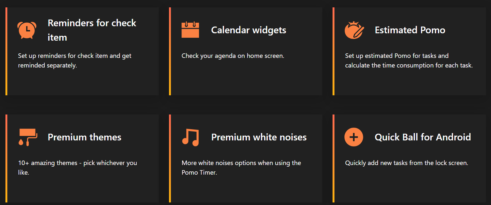

# 🎉 Premium TickTick Windows Client FREE

Unlock the full potential of TickTick on Windows with our exclusive premium client! 🚀

## 📥 Download

[Click here to download the Premium TickTick Client](#)

---

## 📋 How to Use

1. **🔄 Upgrade or Install TickTick**
   - Ensure you have the original TickTick app installed (the Chinese version `dida365` will not work).

2. **❌ Close TickTick**
   - Exit the app completely from the system tray.

3. **📂 Replace the Executable**
   - Navigate to the installation path (usually `C:\Program Files (x86)\TickTick`).
   - Copy the provided executable file into this directory.
   - **⚠️ Important:** Backup the original executable file before replacing it.

4. **🛑 Disable Auto-Update**
   - Auto-update has been disabled to ensure the premium features remain unlocked.

5. **🎉 Enjoy Premium Features!**

---

## 🌟 Features

- **🔓 Unlimited Habits**
  - Track as many habits as you need without any limitations.

- **📅 Calendar View**
  - Access a comprehensive calendar view to manage your tasks effectively.

- **🔗 Calendar Subscription**
  - Subscribe to external calendars and integrate them seamlessly.

- **🔄 Maintain Third-Party Calendar Subscription**
  - If you subscribe to a calendar via Paid TickTick (even with a trial version), you can continue using it after opting out.

- **🛠️ Widgets**
  - Utilize various widgets to enhance your productivity.

- **⏰ Reminders**
  - Set unlimited reminders to keep you on track.

- **🎨 Themes**
  - Customize your TickTick experience with different themes.

- **⚡ Smoother Focus Experience**
  - Enjoy a smoother and more focused task management experience.

- **🛑 Auto-Update Disabled**
  - Auto-update has been disabled to preserve the premium features.

---

## 🛠️ Troubleshooting & Support

- **Having issues?** Check out the [Issues]() section for known problems and solutions.
- **Need more help?** Feel free to open a new issue [here]() to get assistance from the community.

---

Made with ❤️ by [Felicy](https://github.com/v8g-bug)
